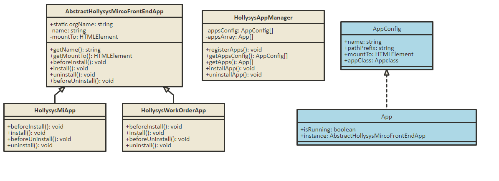

# hollysysyMircoFrontEndDraft

微前端架构雏形，使用最简单的模式来理解微前端

## 时序图



## 类解释

### AbstractHollysysMircoFrontEndApp

 抽象微前端所有应用，定义公共属性和抽象方法,所有微前端应用实现，需要基础该抽象类，并实现抽象方法

 ```js
export abstract class AbstractHollysysMircoFrontEndApp {
    constructor(name: string, mountTo: HTMLElement) {
        this.name = name;
        this.mountTo = mountTo;
    }
    
    //定义静态属性，组织机构名称
    public static orgName: string = "@hollysys";

    //微应用名称
    private name: string;

    //挂载的DOM节点
    private mountTo: HTMLElement;

    //获取名称
    public getName(): string {
        return this.name;
    }

    //获取挂载节点
    public getMountTo(): HTMLElement {
        return this.mountTo;
    }

    //定义一系列 hook，微应用可自行实现hook
    abstract beforeInstall(): void;

    abstract install(): void;

    abstract uninstall(): void;

    abstract beforeUninstall(): void;
}
 
 ```